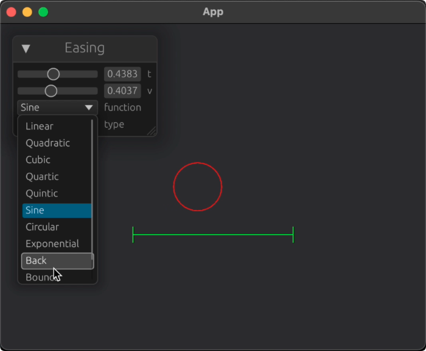
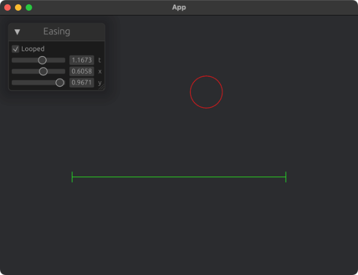

# timeline_rs

[](https://crates.io/crates/timeline_rs)
[](https://docs.rs/timeline_rs)
[](LICENSE)

This is a simple timeline library for Rust. It is designed to be used in a game engine, but can be used for any purpose.

This work is heavily inspired by [ofxTimeline](https://github.com/YCAMInterlab/ofxTimeline) ([my fork](https://github.com/funatsufumiya/ofxTimeline)) of [YCAMInterlab](https://github.com/YCAMInterlab), and intended to use data created by ofxTimeline and [loaf_timeline](https://github.com/funatsufumiya/loaf_timeline/) (lua/oF scripting environment using ofxTimeline).

## Examples

### Easing Tester



```bash
$ cargo run --example easing_tester --features bevy_example
```

```
use timeline_rs::easing;

fn easing_functions_list() -> Vec<(&'static str, easing::EasingFunction)> {
    vec![
        ("Linear", easing::EasingFunction::Linear),
        ("Sine", easing::EasingFunction::Sine),
        ("Circular", easing::EasingFunction::Circular),
        ("Quadratic", easing::EasingFunction::Quadratic),
        ("Cubic", easing::EasingFunction::Cubic),
        ("Quartic", easing::EasingFunction::Quartic),
        ("Quintic", easing::EasingFunction::Quintic),
        ("Exponential", easing::EasingFunction::Exponential),
        ("Back", easing::EasingFunction::Back),
        ("Bounce", easing::EasingFunction::Bounce),
        ("Elastic", easing::EasingFunction::Elastic),
    ]
}

fn easing_type_list() -> Vec<(&'static str, easing::EasingType)> {
    vec![
        ("In", easing::EasingType::In),
        ("Out", easing::EasingType::Out),
        ("InOut", easing::EasingType::InOut),
    ]
}

/// ...

let v: f32 = easing::easing(
    t,
    0.0,
    1.0,
    duration,
    easing_function,
    easing_type,
);
```

### Timeline Simple



```bash
$ cargo run --example timeline_simple --features bevy_example
```

```rust
let mut tl = Timeline::new();

let mut tx = Track::<f32>::default();
tx
    .add_keyframe(Keyframe {
        time: s(0.0),
        value: 0.0,
        easing_function: EasingFunction::Quintic,
        easing_type: EasingType::In,
    })
    .add_keyframe(Keyframe {
        time: s(1.0),
        value: 0.5,
        easing_function: EasingFunction::Bounce,
        easing_type: EasingType::Out,
    })
    .add_keyframe(Keyframe {
        time: s(2.0),
        value: 1.0,
        easing_function: EasingFunction::Linear,
        easing_type: EasingType::In,
    });

tl.add("x", tx);

/// ...

let x: f32 = tl.get_value("x", Duration::from_secs_f32(data.t)).into();
```

### Timeline From XML


```bash
$ cargo run --example timeline_from_xml --features bevy_example
```

```rust
let mut tl = Timeline::new();

let xml_x = r#"
    <keyframes>
    <key>
        <easefunc>0</easefunc>
        <easetype>0</easetype>
        <time>00:00:00:524</time>
        <value>0.375000000</value>
    </key>
    <key>
        <easefunc>4</easefunc>
        <easetype>0</easetype>
        <time>00:00:02:123</time>
        <value>0.330175757</value>
    </key>
    </keyframes>
    "#;

tl.load_xml_str::<f32>("x", xml_x).unwrap();

/// ...

let x: f32 = tl.get_value("x", Duration::from_secs_f32(data.t)).into();
```

NOTE: You can also parse JSON using `tl.load_json_str`, and also directly from file (`load_xml`, `load_json`.)

## License Acknowledgements

My code-base is published under WTFPL and/or 0BSD (see [LICENSE_WTFPL](./LICENSE_WTFPL) and/or [LICENSE_0BSD](./LICENSE_0BSD)). However, the dependencies of this project have different licenses.

- `easing.rs` is ported from [ofxEasing.h](https://github.com/arturoc/ofxEasing/blob/master/src/ofxEasing.h) used in [ofxEasing](https://github.com/arturoc/ofxEasing), based on [terms of use](https://github.com/arturoc/ofxEasing/blob/3a15beffb9cfdce26ffafb1f78e06e730b26c239/src/easing_terms_of_use.html) (BSD License).

### Referenced projects

This lib is created to use data of [ofxTimeline](https://github.com/YCAMInterlab/ofxTimeline) of [YCAMInterlab](https://github.com/YCAMInterlab) and [loaf_timeline](https://github.com/funatsufumiya/loaf_timeline/) (lua/oF scripting environment using ofxTimeline).

Some code-bases are referenced from ofxTimeline, and some dependencies are also referenced like ofxEasing and ofxTween.

- [ofxEasing](https://github.com/arturoc/ofxEasing), is licensed under the MIT license. see [ofxEasing's LICENSE](https://github.com/arturoc/ofxEasing/blob/master/LICENSE)
- [ofxTween](https://github.com/arturoc/ofxTween), is licensed under the MIT license. see [ofxTween's LICENSE](https://github.com/arturoc/ofxTween/blob/master/LICENSE)
- [ofxTimeline](https://github.com/YCAMInterlab/ofxTimeline), is licensed under the Apache license. see [ofxTimeline's README](https://github.com/YCAMInterlab/ofxTimeline/blob/master/README.md)
